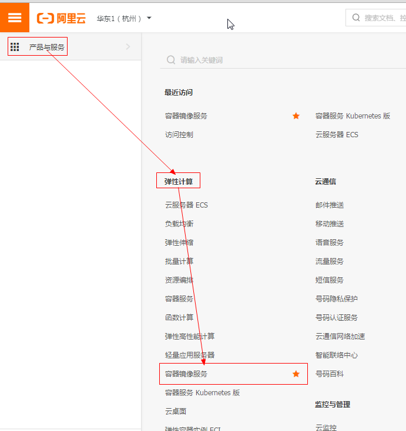

# Docker CE 镜像

[[来源] 阿里云镜像站](https://developer.aliyun.com/mirror/docker-ce?spm=a2c6h.13651102.0.0.3e221b11Vnzr56)

## 简介

Docker CE 是免费的 Docker 产品的新名称，Docker CE 包含了完整的 Docker 平台，非常适合开发人员和运维团队构建容器 APP。

## 配置方法

**CentOS 7（使用 yum 进行安装）**

```shell
# step 1: 安装必要的一些系统工具
sudo yum install -y yum-utils device-mapper-persistent-data lvm2

# Step 2: 添加软件源信息
sudo yum-config-manager --add-repo https://mirrors.aliyun.com/docker-ce/linux/centos/docker-ce.repo
# PS:如果出现如下错误信息
Loaded plugins: fastestmirror
adding repo from: https://mirrors.aliyun.com/docker-ce/linux/centos/docker-ce.repo
grabbing file https://mirrors.aliyun.com/docker-ce/linux/centos/docker-ce.repo to /etc/yum.repos.d/docker-ce.repo
Could not fetch/save url https://mirrors.aliyun.com/docker-ce/linux/centos/docker-ce.repo to file /etc/yum.repos.d/docker-ce.repo: [Errno 14] curl#60 - "Peer's Certificate issuer is not recognized."
# 编辑 /etc/yum.conf 文件, 在 [main] 下面添加 sslverify=0 参数
vi /etc/yum.conf
# 配置如下----------------------
[main]
sslverify=0
# -----------------------------

# Step 3: 更新并安装Docker-CE
sudo yum makecache fast
sudo yum -y install docker-ce

# Step 4: 开启Docker服务
sudo service docker start

# 注意：
# 官方软件源默认启用了最新的软件，您可以通过编辑软件源的方式获取各个版本的软件包。例如官方并没有将测试版本的软件源置为可用，您可以通过以下方式开启。同理可以开启各种测试版本等。
# vim /etc/yum.repos.d/docker-ee.repo
#   将[docker-ce-test]下方的enabled=0修改为enabled=1
#
# 安装指定版本的Docker-CE:
# Step 1: 查找Docker-CE的版本:
# yum list docker-ce.x86_64 --showduplicates | sort -r
#   Loading mirror speeds from cached hostfile
#   Loaded plugins: branch, fastestmirror, langpacks
#   docker-ce.x86_64            17.03.1.ce-1.el7.centos            docker-ce-stable
#   docker-ce.x86_64            17.03.1.ce-1.el7.centos            @docker-ce-stable
#   docker-ce.x86_64            17.03.0.ce-1.el7.centos            docker-ce-stable
#   Available Packages
# Step2: 安装指定版本的Docker-CE: (VERSION例如上面的17.03.0.ce.1-1.el7.centos)
# sudo yum -y install docker-ce-[VERSION]
```

**Ubuntu 14.04/16.04（使用 apt-get 进行安装）**

```shell
# step 1: 安装必要的一些系统工具
sudo apt-get update
sudo apt-get -y install apt-transport-https ca-certificates curl software-properties-common
# step 2: 安装GPG证书
curl -fsSL https://mirrors.aliyun.com/docker-ce/linux/ubuntu/gpg | sudo apt-key add -
# Step 3: 写入软件源信息
sudo add-apt-repository "deb [arch=amd64] https://mirrors.aliyun.com/docker-ce/linux/ubuntu $(lsb_release -cs) stable"
# Step 4: 更新并安装Docker-CE
sudo apt-get -y update
sudo apt-get -y install docker-ce

# 安装指定版本的Docker-CE:
# Step 1: 查找Docker-CE的版本:
# apt-cache madison docker-ce
#   docker-ce | 17.03.1~ce-0~ubuntu-xenial | https://mirrors.aliyun.com/docker-ce/linux/ubuntu xenial/stable amd64 Packages
#   docker-ce | 17.03.0~ce-0~ubuntu-xenial | https://mirrors.aliyun.com/docker-ce/linux/ubuntu xenial/stable amd64 Packages
# Step 2: 安装指定版本的Docker-CE: (VERSION例如上面的17.03.1~ce-0~ubuntu-xenial)
# sudo apt-get -y install docker-ce=[VERSION]
```

**安装校验**

```shell
root@iZbp12adskpuoxodbkqzjfZ:$ docker version
Client:
 Version:      17.03.0-ce
 API version:  1.26
 Go version:   go1.7.5
 Git commit:   3a232c8
 Built:        Tue Feb 28 07:52:04 2017
 OS/Arch:      linux/amd64

Server:
 Version:      17.03.0-ce
 API version:  1.26 (minimum version 1.12)
 Go version:   go1.7.5
 Git commit:   3a232c8
 Built:        Tue Feb 28 07:52:04 2017
 OS/Arch:      linux/amd64
 Experimental: false
```

## Docker 加速

由于 Docker 默认下载镜像的仓库是在国外的, 因此国内用户访问相对来说会较慢一些, 目前国内一些大公司与学校搭建了一些国内的镜像仓库, 可以让我们在下载镜像时更方便些

### 阿里云镜像仓库配置

注册阿里云账号，并登陆到阿里云后台，进入控制台面板


进入控制台以后，找到左上方的三横的功能列表按钮，在弹出来的功能列表处选择`弹性计算`下的`容器镜像服务`



进入`容器镜像服务`页面后，点击左侧菜单栏中`镜像中心`下的`镜像加速器`菜单获取镜像加速器地址，在操作文档处选择 Docker 所在服务器的操作系统，并按照文档提示完成配置即可

#### CentOS

针对Docker客户端版本大于 1.10.0 的用户

您可以通过修改daemon配置文件/etc/docker/daemon.json来使用加速器

```
sudo mkdir -p /etc/docker
sudo tee /etc/docker/daemon.json <<-'EOF'
{
  "registry-mirrors": ["此处修改成你自己的加速 url"]
}
EOF
sudo systemctl daemon-reload
sudo systemctl restart docker
```

#### Mac

针对安装了Docker Toolbox的用户，您可以参考以下配置步骤：

创建一台安装有Docker环境的Linux虚拟机，指定机器名称为default，同时配置Docker加速器地址。

```
docker-machine create --engine-registry-mirror=修改成你自己的加速url -d virtualbox default
```

查看机器的环境配置，并配置到本地，并通过Docker客户端访问Docker服务。

```
docker-machine env defaulteval "$(docker-machine env default)"docker info
```

针对安装了Docker for Mac的用户，您可以参考以下配置步骤：

在任务栏点击 Docker Desktop 应用图标 -> Perferences，在左侧导航菜单选择 Docker Engine，在右侧输入栏编辑 json 文件。将

你自己的加速url加入到"registry-mirrors"的数组里，点击 Apply & Restart按钮，等待Docker重启并应用配置的镜像加速器。

#### Windows

针对安装了Docker Toolbox的用户，您可以参考以下配置步骤：

创建一台安装有Docker环境的Linux虚拟机，指定机器名称为default，同时配置Docker加速器地址。

```
docker-machine create --engine-registry-mirror=修改成你自己的加速url -d virtualbox default
```

查看机器的环境配置，并配置到本地，并通过Docker客户端访问Docker服务。

```
docker-machine env defaulteval "$(docker-machine env default)"docker info
```

针对安装了Docker for Windows的用户，您可以参考以下配置步骤：

在系统右下角托盘图标内右键菜单选择 Settings，打开配置窗口后左侧导航菜单选择 Docker Daemon。编辑窗口内的JSON串，填写下方加速器地址：

```
{
  "registry-mirrors": ["修改成你自己的加速url"]
}
```

编辑完成后点击 Apply 保存按钮，等待Docker重启并应用配置的镜像加速器。

##### 注意

Docker for Windows 和 Docker Toolbox互不兼容，如果同时安装两者的话，需要使用hyperv的参数启动。

```
docker-machine create --engine-registry-mirror=修改成你自己的加速url -d hyperv default
```

Docker for Windows 有两种运行模式，一种运行Windows相关容器，一种运行传统的Linux容器。同一时间只能选择一种模式运行。

## 相关链接

- 下载地址：https://mirrors.aliyun.com/docker-ce/
- 官方主页：https://www.docker.com/community-edition