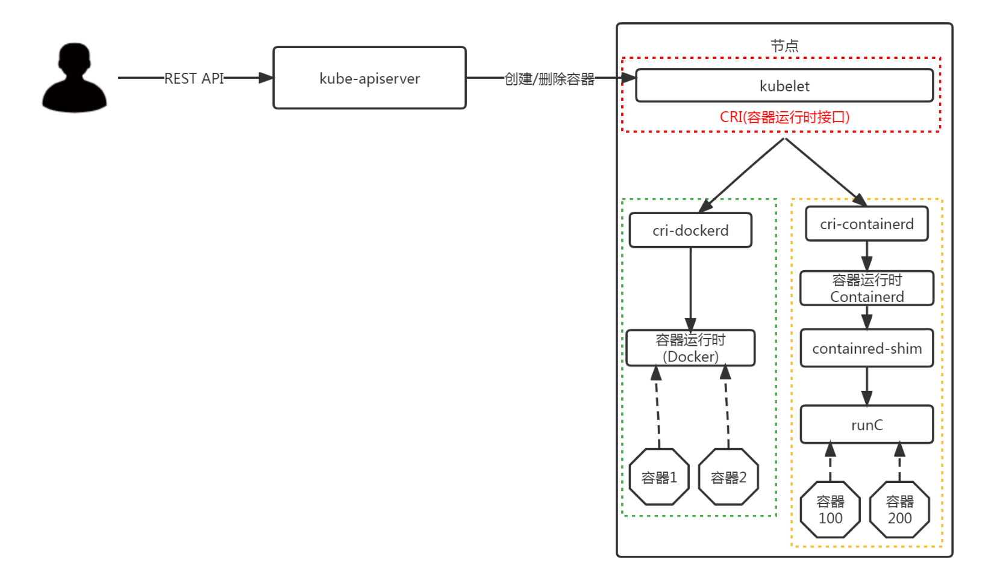
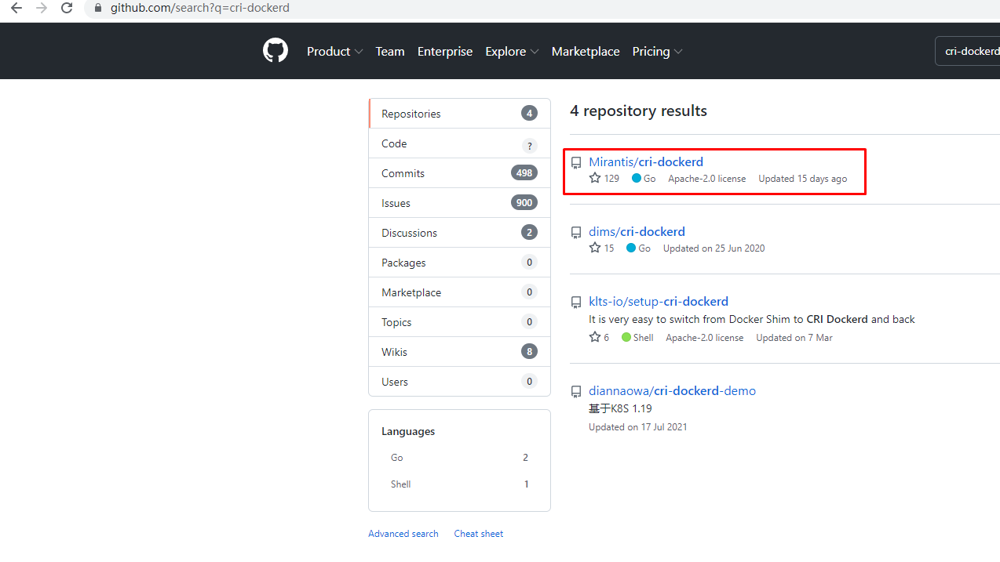
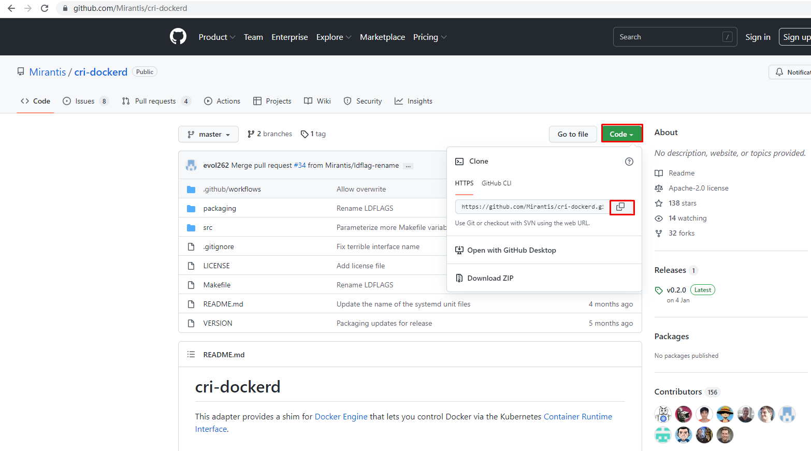
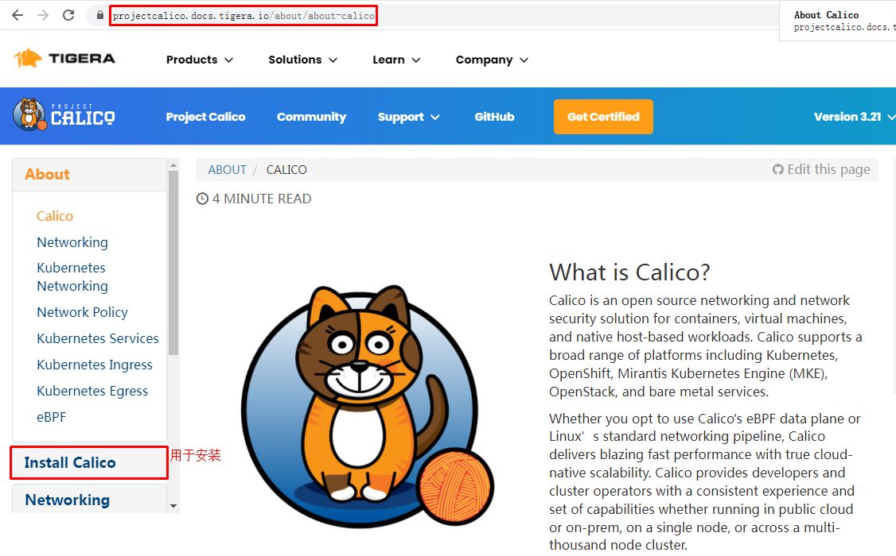
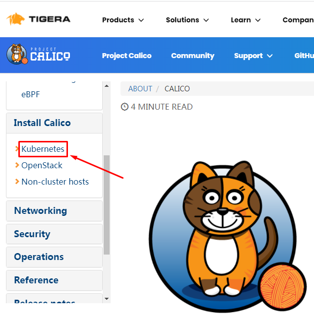
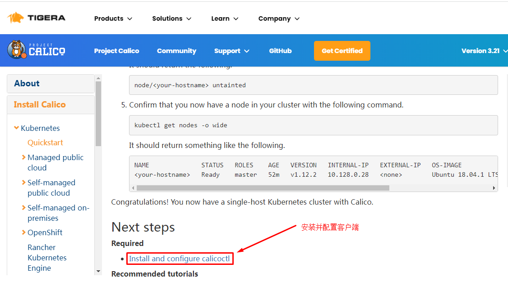

# kubeadm极速部署Kubernetes 1.24版本集群

# 一、Kubernetes 1.24版本发布及重磅改动

## 1.1 Kubernetes 1.24 发布

2022 年 5 月 3 日，Kubernetes 1.24 正式发布，在新版本中，我们看到 Kubernetes 作为容器编排的事实标准，正愈发变得成熟，**有 12 项功能都更新到了稳定版本**，同时引入了很多实用的功能，例如 **StatefulSets 支持批量滚动更新**，**NetworkPolicy 新增 NetworkPolicyStatus 字段方便进行故障排查等**

## 1.2 Kubernetes 1.24 重磅改动

Kubernetes 正式移除对 Dockershim 的支持，讨论很久的 “弃用 Dockershim” 也终于在这个版本画上了句号。

# 二、Kubernetes 1.24版本集群部署

## 2.1 Kubernetes 1.24版本集群部署环境准备

### 2.1.1 主机操作系统说明

| 序号 | 操作系统及版本 | 备注 |
| :--: | :------------: | :--: |
|  1   |   CentOS7u9    |      |

### 2.1.2 主机硬件配置说明

| 需求 | CPU  | 内存 | 硬盘  | 角色         | 主机名       |
| ---- | ---- | ---- | ----- | ------------ | ------------ |
| 值   | 4C   | 8G   | 100GB | master       | k8s-master01 |
| 值   | 4C   | 8G   | 100GB | worker(node) | k8s-worker01 |
| 值   | 4C   | 8G   | 100GB | worker(node) | k8s-worker02 |

### 2.1.3 主机配置

#### 2.1.3.1  主机名配置

由于本次使用3台主机完成kubernetes集群部署，其中1台为master节点,名称为k8s-master01;其中2台为worker节点，名称分别为：k8s-worker01及k8s-worker02

~~~powershell
master节点
# hostnamectl set-hostname k8s-master01
~~~

~~~powershell
worker01节点
# hostnamectl set-hostname k8s-worker01
~~~

~~~powershell
worker02节点
# hostnamectl set-hostname k8s-worker02
~~~

#### 2.1.3.2 主机IP地址配置

~~~powershell
k8s-master节点IP地址为：192.168.10.200/24
# vim /etc/sysconfig/network-scripts/ifcfg-ens33
TYPE="Ethernet"
PROXY_METHOD="none"
BROWSER_ONLY="no"
BOOTPROTO="none"
DEFROUTE="yes"
IPV4_FAILURE_FATAL="no"
IPV6INIT="yes"
IPV6_AUTOCONF="yes"
IPV6_DEFROUTE="yes"
IPV6_FAILURE_FATAL="no"
IPV6_ADDR_GEN_MODE="stable-privacy"
NAME="ens33"
DEVICE="ens33"
ONBOOT="yes"
IPADDR="192.168.10.200"
PREFIX="24"
GATEWAY="192.168.10.2"
DNS1="119.29.29.29"
~~~

~~~powershell
k8s-worker1节点IP地址为：192.168.10.201/24
# vim /etc/sysconfig/network-scripts/ifcfg-ens33
TYPE="Ethernet"
PROXY_METHOD="none"
BROWSER_ONLY="no"
BOOTPROTO="none"
DEFROUTE="yes"
IPV4_FAILURE_FATAL="no"
IPV6INIT="yes"
IPV6_AUTOCONF="yes"
IPV6_DEFROUTE="yes"
IPV6_FAILURE_FATAL="no"
IPV6_ADDR_GEN_MODE="stable-privacy"
NAME="ens33"
DEVICE="ens33"
ONBOOT="yes"
IPADDR="192.168.10.201"
PREFIX="24"
GATEWAY="192.168.10.2"
DNS1="119.29.29.29"
~~~

~~~powershell
k8s-worker2节点IP地址为：192.168.10.202/24
# vim /etc/sysconfig/network-scripts/ifcfg-ens33
TYPE="Ethernet"
PROXY_METHOD="none"
BROWSER_ONLY="no"
BOOTPROTO="none"
DEFROUTE="yes"
IPV4_FAILURE_FATAL="no"
IPV6INIT="yes"
IPV6_AUTOCONF="yes"
IPV6_DEFROUTE="yes"
IPV6_FAILURE_FATAL="no"
IPV6_ADDR_GEN_MODE="stable-privacy"
NAME="ens33"
DEVICE="ens33"
ONBOOT="yes"
IPADDR="192.168.10.202"
PREFIX="24"
GATEWAY="192.168.10.2"
DNS1="119.29.29.29"

~~~

#### 2.1.3.3 主机名与IP地址解析

> 所有集群主机均需要进行配置。

~~~powershell
# cat /etc/hosts
127.0.0.1   localhost localhost.localdomain localhost4 localhost4.localdomain4
::1         localhost localhost.localdomain localhost6 localhost6.localdomain6
192.168.10.200 k8s-master01
192.168.10.201 k8s-worker01
192.168.10.202 k8s-worker02
~~~

#### 2.1.3.4  防火墙配置

> 所有主机均需要操作。

~~~powershell
关闭现有防火墙firewalld
# systemctl disable firewalld
# systemctl stop firewalld
# firewall-cmd --state
not running
~~~

#### 2.1.3.5 SELINUX配置

> 所有主机均需要操作。修改SELinux配置需要重启操作系统。

~~~powershell
# sed -ri 's/SELINUX=enforcing/SELINUX=disabled/' /etc/selinux/config
~~~

#### 2.1.3.6 时间同步配置

>所有主机均需要操作。最小化安装系统需要安装ntpdate软件。

~~~powershell
# crontab -l
0 */1 * * * /usr/sbin/ntpdate time1.aliyun.com
~~~

#### 2.1.3.7 升级操作系统内核

> 所有主机均需要操作。

~~~powershell
导入elrepo gpg key
# rpm --import https://www.elrepo.org/RPM-GPG-KEY-elrepo.org
~~~

~~~powershell
安装elrepo YUM源仓库
# yum -y install https://www.elrepo.org/elrepo-release-7.0-4.el7.elrepo.noarch.rpm
~~~

~~~powershell
安装kernel-ml版本，ml为长期稳定版本，lt为长期维护版本
# yum --enablerepo="elrepo-kernel" -y install kernel-ml.x86_64
~~~

~~~powershell
设置grub2默认引导为0
# grub2-set-default 0
~~~

~~~powershell
重新生成grub2引导文件
# grub2-mkconfig -o /boot/grub2/grub.cfg
~~~

~~~powershell
更新后，需要重启，使用升级的内核生效。
# reboot
~~~

~~~powershell
重启后，需要验证内核是否为更新对应的版本
# uname -r
~~~

#### 2.1.3.8  配置内核转发及网桥过滤

>所有主机均需要操作。

~~~powershell
添加网桥过滤及内核转发配置文件
# cat /etc/sysctl.d/k8s.conf
net.bridge.bridge-nf-call-ip6tables = 1
net.bridge.bridge-nf-call-iptables = 1
net.ipv4.ip_forward = 1
vm.swappiness = 0
~~~

~~~powershell
加载br_netfilter模块
# modprobe br_netfilter
~~~

~~~powershell
查看是否加载
# lsmod | grep br_netfilter
br_netfilter           22256  0
bridge                151336  1 br_netfilter
~~~

~~~powershell
加载网桥过滤及内核转发配置文件
# sysctl -p /etc/sysctl.d/k8s.conf
net.bridge.bridge-nf-call-ip6tables = 1
net.bridge.bridge-nf-call-iptables = 1
net.ipv4.ip_forward = 1
vm.swappiness = 0
~~~

#### 2.1.3.9 安装ipset及ipvsadm

> 所有主机均需要操作。

~~~powershell
安装ipset及ipvsadm
# yum -y install ipset ipvsadm
~~~

~~~powershell
配置ipvsadm模块加载方式
添加需要加载的模块
# cat > /etc/sysconfig/modules/ipvs.modules <<EOF
#!/bin/bash
modprobe -- ip_vs
modprobe -- ip_vs_rr
modprobe -- ip_vs_wrr
modprobe -- ip_vs_sh
modprobe -- nf_conntrack
EOF
~~~

~~~powershell
授权、运行、检查是否加载
# chmod 755 /etc/sysconfig/modules/ipvs.modules && bash /etc/sysconfig/modules/ipvs.modules && lsmod | grep -e ip_vs -e nf_conntrack
~~~

#### 2.1.3.10 关闭SWAP分区

> 修改完成后需要重启操作系统，如不重启，可临时关闭，命令为swapoff -a

~~~powershell
永远关闭swap分区，需要重启操作系统
# cat /etc/fstab
......

# /dev/mapper/centos-swap swap                    swap    defaults        0 0

在上一行中行首添加#
~~~

## 2.2  Docker准备

### 2.2.1 Docker安装YUM源准备

>使用阿里云开源软件镜像站。

~~~powershell
# wget https://mirrors.aliyun.com/docker-ce/linux/centos/docker-ce.repo -O /etc/yum.repos.d/docker-ce.repo
~~~

### 2.2.2 Docker安装

~~~powershell
# yum -y install docker-ce
~~~

### 2.2.3 启动Docker服务

~~~powershell
# systemctl enable --now docker
~~~

### 2.2.4 修改cgroup方式

>/etc/docker/daemon.json 默认没有此文件，需要单独创建

~~~powershell
在/etc/docker/daemon.json添加如下内容

# cat /etc/docker/daemon.json
{
        "exec-opts": ["native.cgroupdriver=systemd"]
}
~~~

~~~powershell
# systemctl restart docker
~~~

### 2.2.5 cri-dockerd安装

#### 2.2.5.1 golang环境准备

> 下载链接地址：https://golang.google.cn/dl/

~~~powershell
获取golang安装包
# wget https://golang.google.cn/dl/go1.16.10.linux-amd64.tar.gz
~~~

~~~powershell
解压golang至指定目录
# tar -xzf go1.16.10.linux-amd64.tar.gz -C /usr/local 
~~~

~~~powershell
添加环境变量
# cat /etc/profile
......
export GOROOT=/usr/local/go
export GOPATH=$HOME/go
export PATH=$PATH:$GOROOT/bin:$GOPATH/bin
~~~

~~~powershell
加载/etc/profile文件
# source /etc/profile
~~~

~~~powershell
验证golang是否安装完成
# go version

输出
go version go1.16.10 linux/amd64
~~~

~~~powershell
创建gopath目录
# mkdir -p ~/go/bin ~/go/src ~/go/pkg
~~~

#### 2.2.5.2 构建并安装cri-dockerd

~~~powershell
克隆cri-dockerd源码
# git clone https://github.com/Mirantis/cri-dockerd.git
~~~

~~~powershell
查看克隆下来的目录
# ls
cri-dockerd 
~~~

~~~powershell
查看目录中内容
# ls cri-dockerd/
LICENSE  Makefile  packaging  README.md  src  VERSION
~~~

~~~powershell
# cd cri-dockerd
~~~

~~~powershell
创建bin目录并构建cri-dockerd二进制文件
# mkdir bin
# cd src && go get && go build -o ../bin/cri-dockerd
~~~

~~~powershell
创建/usr/local/bin,默认存在时，可不用创建
# mkdir -p /usr/local/bin

安装cri-dockerd
# install -o root -g root -m 0755 bin/cri-dockerd /usr/local/bin/cri-dockerd

复制服务管理文件至/etc/systemd/system目录中
# cp -a packaging/systemd/* /etc/systemd/system

指定cri-dockerd运行位置
#sed -i -e 's,/usr/bin/cri-dockerd,/usr/local/bin/cri-dockerd,' /etc/systemd/system/cri-docker.service

启动服务
# systemctl daemon-reload
# systemctl enable cri-docker.service
# systemctl enable --now cri-docker.socket
~~~

## 2.3 kubernetes 1.24.0  集群部署

### 2.3.1  集群软件及版本说明

|          | kubeadm                | kubelet                                       | kubectl                |
| -------- | ---------------------- | --------------------------------------------- | ---------------------- |
| 版本     | 1.24.0                 | 1.24.0                                        | 1.24.0                 |
| 安装位置 | 集群所有主机           | 集群所有主机                                  | 集群所有主机           |
| 作用     | 初始化集群、管理集群等 | 用于接收api-server指令，对pod生命周期进行管理 | 集群应用命令行管理工具 |

### 2.3.2  kubernetes YUM源准备

#### 2.3.2.1 谷歌YUM源

~~~powershell
[kubernetes]
name=Kubernetes
baseurl=https://packages.cloud.google.com/yum/repos/kubernetes-el7-x86_64
enabled=1
gpgcheck=0
repo_gpgcheck=0
gpgkey=https://packages.cloud.google.com/yum/doc/yum-key.gpg
        https://packages.cloud.google.com/yum/doc/rpm-package-key.gpg
~~~

#### 2.3.2.2 阿里云YUM源

~~~powershell
[kubernetes]
name=Kubernetes
baseurl=https://mirrors.aliyun.com/kubernetes/yum/repos/kubernetes-el7-x86_64/
enabled=1
gpgcheck=0
repo_gpgcheck=0
gpgkey=https://mirrors.aliyun.com/kubernetes/yum/doc/yum-key.gpg https://mirrors.aliyun.com/kubernetes/yum/doc/rpm-package-key.gpg
~~~

### 2.3.3 集群软件安装

> 所有节点均可安装

~~~powershell
安装
# yum -y install  kubeadm  kubelet kubectl
~~~

### 2.3.4 配置kubelet

>为了实现docker使用的cgroupdriver与kubelet使用的cgroup的一致性，建议修改如下文件内容。

~~~powershell
# vim /etc/sysconfig/kubelet
KUBELET_EXTRA_ARGS="--cgroup-driver=systemd"
~~~

~~~powershell
设置kubelet为开机自启动即可，由于没有生成配置文件，集群初始化后自动启动
# systemctl enable kubelet
~~~

### 2.3.5  集群镜像准备

> 可使用VPN实现下载。

~~~powershell
# kubeadm config images list --kubernetes-version=v1.24.0
k8s.gcr.io/kube-apiserver:v1.24.0
k8s.gcr.io/kube-controller-manager:v1.24.0
k8s.gcr.io/kube-scheduler:v1.24.0
k8s.gcr.io/kube-proxy:v1.24.0
k8s.gcr.io/pause:3.7
k8s.gcr.io/etcd:3.5.3-0
k8s.gcr.io/coredns/coredns:v1.8.6
~~~

~~~powershell
# cat image_download.sh
#!/bin/bash
images_list='
k8s.gcr.io/kube-apiserver:v1.24.0
k8s.gcr.io/kube-controller-manager:v1.24.0
k8s.gcr.io/kube-scheduler:v1.24.0
k8s.gcr.io/kube-proxy:v1.24.0
k8s.gcr.io/pause:3.7
k8s.gcr.io/etcd:3.5.3-0
k8s.gcr.io/coredns/coredns:v1.8.6'

for i in $images_list
do
        docker pull $i
done

docker save -o k8s-1-24-0.tar $images_list
~~~

### 2.3.6 集群初始化

~~~powershell
[root@k8s-master01 ~]# kubeadm init --kubernetes-version=v1.24.0 --pod-network-cidr=10.224.0.0/16 --apiserver-advertise-address=192.168.10.200  --cri-socket unix:///var/run/cri-dockerd.sock
~~~

~~~powershell
如果不添加--cri-socket选项，则会报错，内容如下：
Found multiple CRI endpoints on the host. Please define which one do you wish to use by setting the 'criSocket' field in the kubeadm configuration file: unix:///var/run/containerd/containerd.sock, unix:///var/run/cri-dockerd.sock
To see the stack trace of this error execute with --v=5 or higher
~~~

~~~powershell
初始化过程输出
[init] Using Kubernetes version: v1.24.0
[preflight] Running pre-flight checks
[preflight] Pulling images required for setting up a Kubernetes cluster
[preflight] This might take a minute or two, depending on the speed of your internet connection
[preflight] You can also perform this action in beforehand using 'kubeadm config images pull'
[certs] Using certificateDir folder "/etc/kubernetes/pki"
[certs] Generating "ca" certificate and key
[certs] Generating "apiserver" certificate and key
[certs] apiserver serving cert is signed for DNS names [k8s-master01 kubernetes kubernetes.default kubernetes.default.svc kubernetes.default.svc.cluster.local] and IPs [10.96.0.1 192.168.10.200]
[certs] Generating "apiserver-kubelet-client" certificate and key
[certs] Generating "front-proxy-ca" certificate and key
[certs] Generating "front-proxy-client" certificate and key
[certs] Generating "etcd/ca" certificate and key
[certs] Generating "etcd/server" certificate and key
[certs] etcd/server serving cert is signed for DNS names [k8s-master01 localhost] and IPs [192.168.10.200 127.0.0.1 ::1]
[certs] Generating "etcd/peer" certificate and key
[certs] etcd/peer serving cert is signed for DNS names [k8s-master01 localhost] and IPs [192.168.10.200 127.0.0.1 ::1]
[certs] Generating "etcd/healthcheck-client" certificate and key
[certs] Generating "apiserver-etcd-client" certificate and key
[certs] Generating "sa" key and public key
[kubeconfig] Using kubeconfig folder "/etc/kubernetes"
[kubeconfig] Writing "admin.conf" kubeconfig file
[kubeconfig] Writing "kubelet.conf" kubeconfig file
[kubeconfig] Writing "controller-manager.conf" kubeconfig file
[kubeconfig] Writing "scheduler.conf" kubeconfig file
[kubelet-start] Writing kubelet environment file with flags to file "/var/lib/kubelet/kubeadm-flags.env"
[kubelet-start] Writing kubelet configuration to file "/var/lib/kubelet/config.yaml"
[kubelet-start] Starting the kubelet
[control-plane] Using manifest folder "/etc/kubernetes/manifests"
[control-plane] Creating static Pod manifest for "kube-apiserver"
[control-plane] Creating static Pod manifest for "kube-controller-manager"
[control-plane] Creating static Pod manifest for "kube-scheduler"
[etcd] Creating static Pod manifest for local etcd in "/etc/kubernetes/manifests"
[wait-control-plane] Waiting for the kubelet to boot up the control plane as static Pods from directory "/etc/kubernetes/manifests". This can take up to 4m0s
[apiclient] All control plane components are healthy after 13.006785 seconds
[upload-config] Storing the configuration used in ConfigMap "kubeadm-config" in the "kube-system" Namespace
[kubelet] Creating a ConfigMap "kubelet-config" in namespace kube-system with the configuration for the kubelets in the cluster
[upload-certs] Skipping phase. Please see --upload-certs
[mark-control-plane] Marking the node k8s-master01 as control-plane by adding the labels: [node-role.kubernetes.io/control-plane node.kubernetes.io/exclude-from-external-load-balancers]
[mark-control-plane] Marking the node k8s-master01 as control-plane by adding the taints [node-role.kubernetes.io/master:NoSchedule node-role.kubernetes.io/control-plane:NoSchedule]
[bootstrap-token] Using token: 8x4o2u.hslo8xzwwlrncr8s
[bootstrap-token] Configuring bootstrap tokens, cluster-info ConfigMap, RBAC Roles
[bootstrap-token] Configured RBAC rules to allow Node Bootstrap tokens to get nodes
[bootstrap-token] Configured RBAC rules to allow Node Bootstrap tokens to post CSRs in order for nodes to get long term certificate credentials
[bootstrap-token] Configured RBAC rules to allow the csrapprover controller automatically approve CSRs from a Node Bootstrap Token
[bootstrap-token] Configured RBAC rules to allow certificate rotation for all node client certificates in the cluster
[bootstrap-token] Creating the "cluster-info" ConfigMap in the "kube-public" namespace
[kubelet-finalize] Updating "/etc/kubernetes/kubelet.conf" to point to a rotatable kubelet client certificate and key
[addons] Applied essential addon: CoreDNS
[addons] Applied essential addon: kube-proxy

Your Kubernetes control-plane has initialized successfully!

To start using your cluster, you need to run the following as a regular user:

  mkdir -p $HOME/.kube
  sudo cp -i /etc/kubernetes/admin.conf $HOME/.kube/config
  sudo chown $(id -u):$(id -g) $HOME/.kube/config

Alternatively, if you are the root user, you can run:

  export KUBECONFIG=/etc/kubernetes/admin.conf

You should now deploy a pod network to the cluster.
Run "kubectl apply -f [podnetwork].yaml" with one of the options listed at:
  https://kubernetes.io/docs/concepts/cluster-administration/addons/

Then you can join any number of worker nodes by running the following on each as root:

kubeadm join 192.168.10.200:6443 --token 8x4o2u.hslo8xzwwlrncr8s \
        --discovery-token-ca-cert-hash sha256:7323a8b0658fc33d89e627f078f6eb16ac94394f9a91b3335dd3ce73a3f313a0
~~~

### 2.3.7  集群应用客户端管理集群文件准备

~~~powershell
[root@k8s-master01 ~]# mkdir -p $HOME/.kube
[root@k8s-master01 ~]# cp -i /etc/kubernetes/admin.conf $HOME/.kube/config
[root@k8s-master01 ~]# chown $(id -u):$(id -g) $HOME/.kube/config
[root@k8s-master01 ~]# ls /root/.kube/
config
~~~

~~~powershell
[root@k8s-master01 ~]# export KUBECONFIG=/etc/kubernetes/admin.conf
~~~

### 2.3.8  集群网络准备

> 使用calico部署集群网络
>
> 安装参考网址：https://projectcalico.docs.tigera.io/about/about-calico

#### 2.3.8.1  calico安装

~~~powershell
下载operator资源清单文件
[root@k8s-master01 ~]# wget https://docs.projectcalico.org/manifests/tigera-operator.yaml
~~~

~~~powershell
应用资源清单文件，创建operator
[root@k8s-master01 ~]# kubectl apply -f tigera-operator.yaml
~~~

~~~powershell
通过自定义资源方式安装
[root@k8s-master01 ~]# wget https://docs.projectcalico.org/manifests/custom-resources.yaml
~~~

~~~powershell
修改文件第13行，修改为使用kubeadm init ----pod-network-cidr对应的IP地址段
[root@k8s-master01 ~]# vim custom-resources.yaml
......
 11     ipPools:
 12     - blockSize: 26
 13       cidr: 10.224.0.0/16 
 14       encapsulation: VXLANCrossSubnet
......
~~~

~~~powershell
应用资源清单文件
[root@k8s-master01 ~]# kubectl apply -f custom-resources.yaml
~~~

~~~powershell
监视calico-sysem命名空间中pod运行情况
[root@k8s-master01 ~]# watch kubectl get pods -n calico-system
~~~

>Wait until each pod has the `STATUS` of `Running`.

~~~powershell
删除 master 上的 taint
[root@k8s-master01 ~]# kubectl taint nodes --all node-role.kubernetes.io/master-
~~~

~~~powershell
已经全部运行
[root@k8s-master01 ~]# kubectl get pods -n calico-system
NAME                                      READY   STATUS    RESTARTS   AGE
calico-kube-controllers-666bb9949-dzp68   1/1     Running   0          11m
calico-node-jhcf4                         1/1     Running   4          11m
calico-typha-68b96d8d9c-7qfq7             1/1     Running   2          11m
~~~

~~~powershell
查看kube-system命名空间中coredns状态，处于Running状态表明联网成功。
[root@k8s-master01 ~]# kubectl get pods -n kube-system
NAME                                   READY   STATUS    RESTARTS   AGE
coredns-6d4b75cb6d-js5pl               1/1     Running   0          12h
coredns-6d4b75cb6d-zm8pc               1/1     Running   0          12h
etcd-k8s-master01                      1/1     Running   0          12h
kube-apiserver-k8s-master01            1/1     Running   0          12h
kube-controller-manager-k8s-master01   1/1     Running   0          12h
kube-proxy-7nhr7                       1/1     Running   0          12h
kube-proxy-fv4kr                       1/1     Running   0          12h
kube-proxy-vv5vg                       1/1     Running   0          12h
kube-scheduler-k8s-master01            1/1     Running   0          12h
~~~

#### 2.3.8.2  calico客户端安装

~~~powershell
下载二进制文件
# curl -L https://github.com/projectcalico/calico/releases/download/v3.21.4/calicoctl-linux-amd64 -o calicoctl

~~~

~~~powershell
安装calicoctl
# mv calicoctl /usr/bin/

为calicoctl添加可执行权限
# chmod +x /usr/bin/calicoctl

查看添加权限后文件
# ls /usr/bin/calicoctl
/usr/bin/calicoctl

查看calicoctl版本
# calicoctl  version
Client Version:    v3.21.4
Git commit:        220d04c94
Cluster Version:   v3.21.4
Cluster Type:      typha,kdd,k8s,operator,bgp,kubeadm
~~~

~~~powershell
通过~/.kube/config连接kubernetes集群，查看已运行节点
# DATASTORE_TYPE=kubernetes KUBECONFIG=~/.kube/config calicoctl get nodes
NAME
k8s-master01
~~~

### 2.3.9  集群工作节点添加

> 因容器镜像下载较慢，可能会导致报错，主要错误为没有准备好cni（集群网络插件），如有网络，请耐心等待即可。

~~~powershell
[root@k8s-worker01 ~]# kubeadm join 192.168.10.200:6443 --token 8x4o2u.hslo8xzwwlrncr8s \                              --discovery-token-ca-cert-hash sha256:7323a8b0658fc33d89e627f078f6eb16ac94394f9a91b3335dd3ce73a3f313a0 --cri-socket unix:///var/run/cri-dockerd.sock
~~~

~~~powershell
[root@k8s-worker02 ~]# kubeadm join 192.168.10.200:6443 --token 8x4o2u.hslo8xzwwlrncr8s \
        --discovery-token-ca-cert-hash sha256:7323a8b0658fc33d89e627f078f6eb16ac94394f9a91b3335dd3ce73a3f313a0 --cri-socket unix:///var/run/cri-dockerd.sock
~~~

~~~powershell
在master节点上操作，查看网络节点是否添加
# DATASTORE_TYPE=kubernetes KUBECONFIG=~/.kube/config calicoctl get nodes
NAME
k8s-master01
k8s-worker01
k8s-worker02
~~~

### 2.3.10 验证集群可用性

~~~powershell
查看所有的节点
[root@k8s-master01 ~]# kubectl get nodes
NAME           STATUS   ROLES           AGE   VERSION
k8s-master01   Ready    control-plane   12h   v1.24.0
k8s-worker01   Ready    <none>          12h   v1.24.0
k8s-worker02   Ready    <none>          12h   v1.24.0
~~~

~~~powershell
查看集群健康情况
[root@k8s-master01 ~]# kubectl get cs
Warning: v1 ComponentStatus is deprecated in v1.19+
NAME                 STATUS    MESSAGE                         ERROR
controller-manager   Healthy   ok
scheduler            Healthy   ok
etcd-0               Healthy   {"health":"true","reason":""}
~~~

~~~powershell
查看kubernetes集群pod运行情况
[root@k8s-master01 ~]# kubectl get pods -n kube-system
NAME                                   READY   STATUS    RESTARTS   AGE
coredns-6d4b75cb6d-js5pl               1/1     Running   0          12h
coredns-6d4b75cb6d-zm8pc               1/1     Running   0          12h
etcd-k8s-master01                      1/1     Running   0          12h
kube-apiserver-k8s-master01            1/1     Running   0          12h
kube-controller-manager-k8s-master01   1/1     Running   0          12h
kube-proxy-7nhr7                       1/1     Running   0          12h
kube-proxy-fv4kr                       1/1     Running   0          12h
kube-proxy-vv5vg                       1/1     Running   0          12h
kube-scheduler-k8s-master01            1/1     Running   0          12h
~~~

~~~powershell
再次查看calico-system命名空间中pod运行情况。
[root@k8s-master01 ~]# kubectl get pods -n calico-system
NAME                                       READY   STATUS    RESTARTS   AGE
calico-kube-controllers-5b544d9b48-xgfnk   1/1     Running   0          12h
calico-node-7clf4                          1/1     Running   0          12h
calico-node-cjwns                          1/1     Running   0          12h
calico-node-hhr4n                          1/1     Running   0          12h
calico-typha-6cb6976b97-5lnpk              1/1     Running   0          12h
calico-typha-6cb6976b97-9w9s8              1/1     Running   0          12h
~~~

