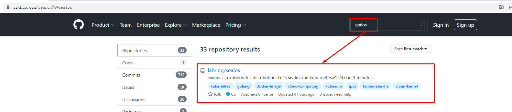
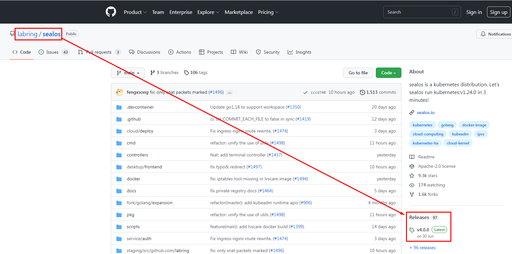
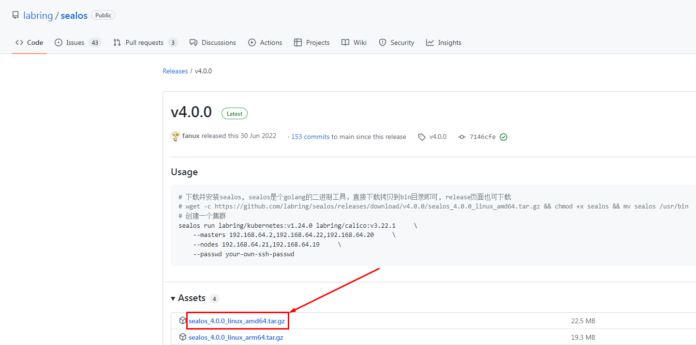
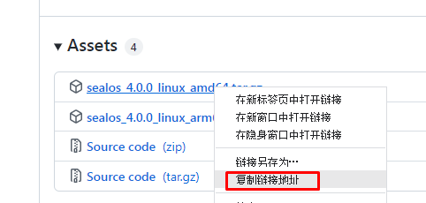
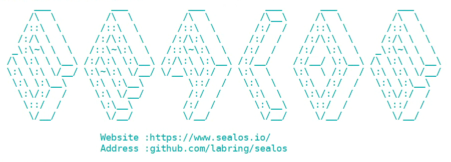

# 微服务项目 kubernetes集群部署

# 一、kubernetes集群节点准备

## 1.1 配置主机名

~~~powershell
# hostnamectl set-hostname xxx

k8s-master01
k8s-master02
k8s-master03
k8s-worker01
k8s-worker02
k8s-worker03
~~~

## 1.2 设置静态IP地址

| 序号 | 主机名       | 主机IP         |
| ---- | ------------ | -------------- |
| 1    | k8s-master01 | 192.168.10.141 |
| 2    | k8s-master02 | 192.168.10.142 |
| 3    | k8s-master03 | 192.168.10.143 |
| 4    | k8s-worker01 | 192.168.10.144 |
| 5    | k8s-worker02 | 192.168.10.145 |
| 6    | k8s-worker03 | 192.168.10.146 |

~~~powershell
# vim /etc/sysconfig/network-scripts/ifcfg-ens33
TYPE="Ethernet"
PROXY_METHOD="none"
BROWSER_ONLY="no"
BOOTPROTO="none"
DEFROUTE="yes"
IPV4_FAILURE_FATAL="no"
IPV6INIT="yes"
IPV6_AUTOCONF="yes"
IPV6_DEFROUTE="yes"
IPV6_FAILURE_FATAL="no"
IPV6_ADDR_GEN_MODE="stable-privacy"
NAME="ens33"
UUID="ec87533a-8151-4aa0-9d0f-1e970affcdc6"
DEVICE="ens33"
ONBOOT="yes"
IPADDR="192.168.10.xxx"
PREFIX="24"
GATEWAY="192.168.10.2"
DNS1="119.29.29.29"
~~~

## 1.3 配置主机名与IP地址解析

> 下面解析是管理员添加，sealos在运行过程中，也会自动添加主机名与IP地址解析关系。

~~~powershell
# /etc/hosts
192.168.10.141 k8s-master01
192.168.10.142 k8s-master02
192.168.10.143 k8s-master03
192.168.10.144 k8s-worker01
192.168.10.145 k8s-worker02
192.168.10.146 k8s-worker03
~~~

## 1.4 升级内核

~~~powershell
rpm --import https://www.elrepo.org/RPM-GPG-KEY-elrepo.org

yum -y install https://www.elrepo.org/elrepo-release-7.0-4.el7.elrepo.noarch.rpm

yum --enablerepo="elrepo-kernel" -y install kernel-lt.x86_64

awk -F \' '$1=="menuentry " {print i++ " : " $2}' /etc/grub2.cfg

grub2-set-default "CentOS Linux (5.4.204-1.el7.elrepo.x86_64) 7 (Core)"

reboot
~~~

# 二、kubernetes集群快速部署工具准备

~~~powershell
[root@k8s-master01 ~]# wget https://github.com/labring/sealos/releases/download/v4.0.0/sealos_4.0.0_linux_amd64.tar.gz
~~~

~~~powershell
[root@k8s-master01 ~]# tar xf sealos_4.0.0_linux_amd64.tar.gz

[root@k8s-master01 ~]# ls
sealctl
sealos
~~~

~~~powershell
[root@k8s-master01 ~]# mv seal* /usr/bin/
~~~

~~~powershell
[root@k8s-master01 ~]# sealos version
{"gitVersion":"4.0.0","gitCommit":"7146cfe","buildDate":"2022-06-30T14:24:31Z","goVersion":"go1.17.11","compiler":"gc","platform":"linux/amd64"}
~~~

# 三、kubernetes集群快速部署

~~~powershell
[root@k8s-master01 ~]# vim sealos-install-k8s.sh
[root@k8s-master01 ~]# cat sealos-install-k8s.sh
sealos run labring/kubernetes:v1.24.0 labring/calico:v3.22.1     \
    --masters 192.168.10.141,192.168.10.142,192.168.10.143     \
    --nodes 192.168.10.144,192.168.10.145,192.168.10.146     \
    --passwd centos
~~~

~~~powershell
[root@k8s-master01 ~]# bash sealos-install-k8s.sh
~~~

# 四、kubernetes集群可用性验证

~~~powershell
[root@k8s-master01 ~]# kubectl get nodes
NAME           STATUS   ROLES           AGE   VERSION
k8s-master01   Ready    control-plane   13m   v1.24.0
k8s-master02   Ready    control-plane   12m   v1.24.0
k8s-master03   Ready    control-plane   11m   v1.24.0
k8s-worker01   Ready    <none>          11m   v1.24.0
k8s-worker02   Ready    <none>          11m   v1.24.0
k8s-worker03   Ready    <none>          11m   v1.24.0
~~~

~~~powershell
[root@k8s-master01 ~]# kubectl get pods -n kube-system
NAME                                   READY   STATUS    RESTARTS   AGE
coredns-6d4b75cb6d-dqhgs               1/1     Running   0          13m
coredns-6d4b75cb6d-kd2xp               1/1     Running   0          13m
etcd-k8s-master01                      1/1     Running   0          13m
etcd-k8s-master02                      1/1     Running   0          12m
etcd-k8s-master03                      1/1     Running   0          11m
kube-apiserver-k8s-master01            1/1     Running   0          13m
kube-apiserver-k8s-master02            1/1     Running   0          12m
kube-apiserver-k8s-master03            1/1     Running   0          11m
kube-controller-manager-k8s-master01   1/1     Running   0          13m
kube-controller-manager-k8s-master02   1/1     Running   0          11m
kube-controller-manager-k8s-master03   1/1     Running   0          11m
kube-proxy-bkfql                       1/1     Running   0          12m
kube-proxy-g7cpp                       1/1     Running   0          11m
kube-proxy-hkm4l                       1/1     Running   0          11m
kube-proxy-n87jt                       1/1     Running   0          11m
kube-proxy-rqjww                       1/1     Running   0          12m
kube-proxy-tpz9d                       1/1     Running   0          13m
kube-scheduler-k8s-master01            1/1     Running   0          13m
kube-scheduler-k8s-master02            1/1     Running   0          11m
kube-scheduler-k8s-master03            1/1     Running   0          10m
kube-sealyun-lvscare-k8s-worker01      1/1     Running   0          11m
kube-sealyun-lvscare-k8s-worker02      1/1     Running   0          11m
kube-sealyun-lvscare-k8s-worker03      1/1     Running   0          11m
~~~

