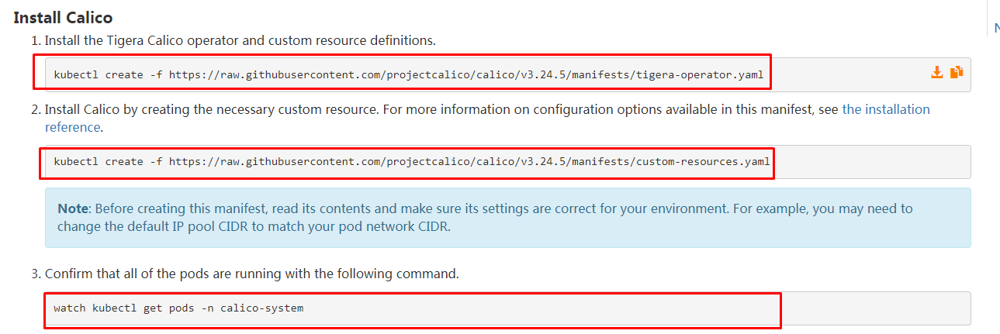
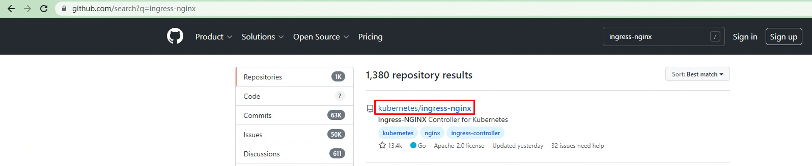
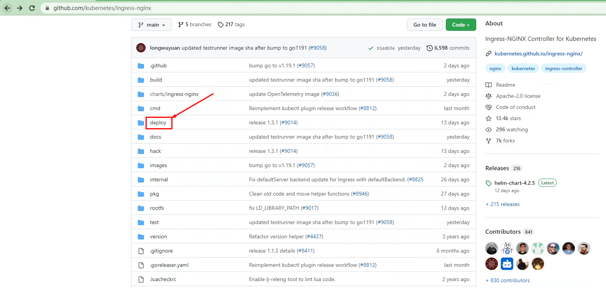
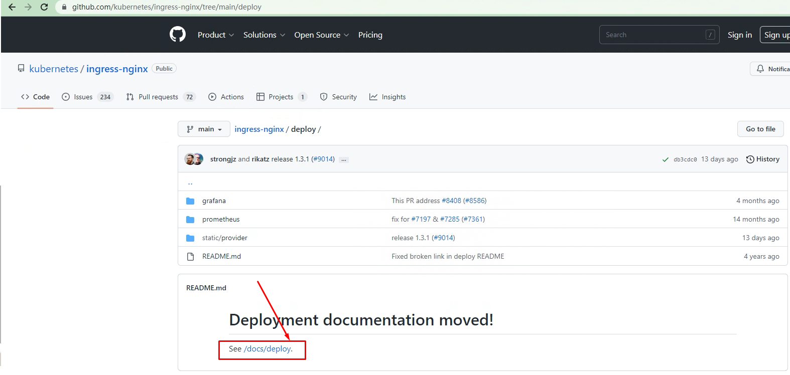
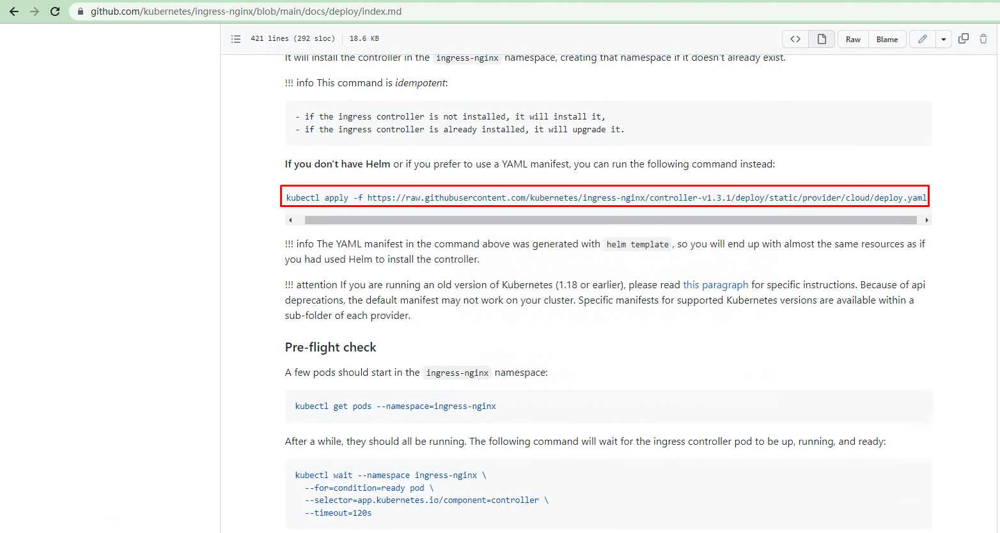

# 构建通用型Kubernetes应用发布生态圈

# 一、Docker安装

## 1.1 Docker安装及配置

### 1.1.1 Docker安装YUM源准备

>使用阿里云开源软件镜像站。

~~~powershell
# wget https://mirrors.aliyun.com/docker-ce/linux/centos/docker-ce.repo -O /etc/yum.repos.d/docker-ce.repo
~~~

### 1.1.2 Docker安装

~~~powershell
# yum -y install docker-ce
~~~

### 1.1.3 启动Docker服务

~~~powershell
# systemctl enable --now docker
~~~

### 1.1.4 修改cgroup方式

>/etc/docker/daemon.json 默认没有此文件，需要单独创建

~~~powershell
在/etc/docker/daemon.json添加如下内容

# cat /etc/docker/daemon.json
{
        "exec-opts": ["native.cgroupdriver=systemd"]
}
~~~

~~~powershell
# systemctl restart docker
~~~

## 1.2 cri-dockerd安装

> 托管链接：https://github.com/Mirantis/cri-dockerd

~~~powershell
git clone https://github.com/Mirantis/cri-dockerd.git
~~~

~~~powershell
###Install GO###
wget https://storage.googleapis.com/golang/getgo/installer_linux
chmod +x ./installer_linux
./installer_linux
source ~/.bash_profile
~~~

~~~powershell
cd cri-dockerd
mkdir bin
go build -o bin/cri-dockerd
mkdir -p /usr/local/bin
install -o root -g root -m 0755 bin/cri-dockerd /usr/local/bin/cri-dockerd
cp -a packaging/systemd/* /etc/systemd/system
sed -i -e 's,/usr/bin/cri-dockerd,/usr/local/bin/cri-dockerd,' /etc/systemd/system/cri-docker.service
systemctl daemon-reload
systemctl enable cri-docker.service
systemctl enable --now cri-docker.socket
~~~

# 二、Kubernetes集群初始化

## 2.1 YUM源准备

~~~powershell
# cat > /etc/yum.repos.d/k8s.repo <<EOF
[kubernetes]
name=Kubernetes
baseurl=https://mirrors.aliyun.com/kubernetes/yum/repos/kubernetes-el7-x86_64/
enabled=1
gpgcheck=0
repo_gpgcheck=0
gpgkey=https://mirrors.aliyun.com/kubernetes/yum/doc/yum-key.gpg https://mirrors.aliyun.com/kubernetes/yum/doc/rpm-package-key.gpg
EOF
~~~

## 2.2 软件安装及配置

### 2.2.1 安装

~~~powershell
默认安装
# yum -y install  kubeadm  kubelet kubectl
~~~

~~~powershell
查看指定版本
# yum list kubeadm.x86_64 --showduplicates | sort -r
# yum list kubelet.x86_64 --showduplicates | sort -r
# yum list kubectl.x86_64 --showduplicates | sort -r

安装指定版本
# yum -y install  kubeadm-1.24.X-0  kubelet-1.24.X-0 kubectl-1.24.X-0
~~~

### 2.2.2 kubelet配置

 

>为了实现docker使用的cgroupdriver与kubelet使用的cgroup的一致性，建议修改如下文件内容。

~~~powershell
# vim /etc/sysconfig/kubelet
KUBELET_EXTRA_ARGS="--cgroup-driver=systemd"
~~~

~~~powershell
设置kubelet为开机自启动即可，由于没有生成配置文件，集群初始化后自动启动
# systemctl enable kubelet
~~~

## 2.3 集群初始化

~~~powershell
[root@k8s-master01 ~]# kubeadm init --kubernetes-version=v1.24.X --pod-network-cidr=10.224.0.0/16 --apiserver-advertise-address=192.168.10.160  --cri-socket unix:///var/run/cri-dockerd.sock
~~~

# 三、网络插件部署 Calico

> 使用calico部署集群网络
>
> 安装参考网址：https://projectcalico.docs.tigera.io/about/about-calico

~~~powershell
# kubectl create -f https://raw.githubusercontent.com/projectcalico/calico/v3.24.5/manifests/tigera-operator.yaml
~~~

~~~powershell
# wget https://raw.githubusercontent.com/projectcalico/calico/v3.24.5/manifests/custom-resources.yaml
~~~

~~~powershell
[root@k8s-master01 ~]# vim custom-resources.yaml
......
 11     ipPools:
 12     - blockSize: 26
 13       cidr: 10.224.0.0/16 
 14       encapsulation: VXLANCrossSubnet
......
~~~

~~~powershell
# kubectl create -f  custom-resources.yaml
~~~

~~~powershell
 当node无法正常运行时，可考虑在此文件中添加相关内容。    
      nodeAddressAutodetectionV4:
        interface: ens.*
~~~

# 四、持久存储卷 动态供给

## 4.1 NFS服务

~~~powershell
# mkdir /netshare
~~~

~~~powershell
# mkfs.xfs /dev/sdb
~~~

~~~powershell
# vim /etc/fstab
...
/dev/sdb	/netshare	xfs		defaults 0 0
~~~

~~~powershell
# mount -a
~~~

~~~powershell
默认安装的可以不用安装
# yum -y install nfs-utils
~~~

~~~powershell
# vim /etc/exports
/netshare	*(rw,sync,no_root_squash)
~~~

~~~powershell
# showmount -e
~~~

## 4.2 动态供给配置

~~~powershell
# showmount -e 192.168.10.163
~~~

### 4.2.1  获取资源清单文件

~~~powershell
在k8s master节点获取NFS后端存储动态供给配置资源清单文件

# for file in class.yaml deployment.yaml rbac.yaml  ; do wget https://raw.githubusercontent.com/kubernetes-incubator/external-storage/master/nfs-client/deploy/$file ; done
~~~

~~~powershell
查看是否下载
# ls
class.yaml  deployment.yaml  rbac.yaml
~~~

### 4.2.2 应用资源清单文件

~~~powershell
应用rbac资源清单文件
# kubectl apply -f rbac.yaml
~~~

~~~powershell
修改存储类名称
# vim class.yaml
# cat class.yaml
apiVersion: storage.k8s.io/v1
kind: StorageClass
metadata:
  name: nfs-client
provisioner: fuseim.pri/ifs # or choose another name, must match deployment's env PROVISIONER_NAME'
parameters:
  archiveOnDelete: "false"
~~~

~~~powershell
应用class（存储类）资源清单文件
# kubectl apply -f class.yaml
storageclass.storage.k8s.io/nfs-client created
~~~

~~~powershell
应用deployment资源清单文件之前修改其配置，主要配置NFS服务器及其共享的目录
# vim deployment.yaml

注意修改处内容

# vim deployment.yaml
# cat deployment.yaml
apiVersion: apps/v1
kind: Deployment
metadata:
  name: nfs-client-provisioner
  labels:
    app: nfs-client-provisioner
  # replace with namespace where provisioner is deployed
  namespace: default
spec:
  replicas: 1
  strategy:
    type: Recreate
  selector:
    matchLabels:
      app: nfs-client-provisioner
  template:
    metadata:
      labels:
        app: nfs-client-provisioner
    spec:
      serviceAccountName: nfs-client-provisioner
      containers:
        - name: nfs-client-provisioner
          image: registry.cn-beijing.aliyuncs.com/pylixm/nfs-subdir-external-provisioner:v4.0.0
          volumeMounts:
            - name: nfs-client-root
              mountPath: /persistentvolumes
          env:
            - name: PROVISIONER_NAME
              value: fuseim.pri/ifs
            - name: NFS_SERVER
              value: 192.168.10.163
            - name: NFS_PATH
              value: /netshare
      volumes:
        - name: nfs-client-root
          nfs:
            server: 192.168.10.163
            path: /netshare

~~~

~~~powershell
应用资源清单文件
# kubectl apply -f deployment.yaml
~~~

~~~powershell
查看pod运行情况

# kubectl get pods
出现以下表示成功运行
NAME                                     READY   STATUS    RESTARTS   AGE
nfs-client-provisioner-8bcf6c987-7cb8p   1/1     Running   0          74s
~~~

~~~powershell
设置默认存储类
# kubectl patch storageclass nfs-client -p '{"metadata": {"annotations":{"storageclass.kubernetes.io/is-default-class":"true"}}}'
~~~

~~~powershell
# kubectl get sc
NAME                   PROVISIONER      RECLAIMPOLICY   VOLUMEBINDINGMODE   ALLOWVOLUMEEXPANSION   AGE
nfs-client (default)   fuseim.pri/ifs   Delete          Immediate           false                  18m
~~~

### 4.2.3 测试用例验证动态供给是否可用

> 使用测试用例测试NFS后端存储是否可用

~~~powershell
测试用例：
# vim nginx.yaml
# cat nginx.yaml
---
apiVersion: v1
kind: Service
metadata:
  name: nginx
  labels:
    app: nginx
spec:
  ports:
  - port: 80
    name: web
  clusterIP: None
  selector:
    app: nginx
---
apiVersion: apps/v1
kind: StatefulSet
metadata:
  name: web
spec:
  selector:
    matchLabels:
      app: nginx
  serviceName: "nginx"
  replicas: 2
  template:
    metadata:
      labels:
        app: nginx
    spec:
      containers:
      - name: nginx
        image: nginx:latest
        ports:
        - containerPort: 80
          name: web
        volumeMounts:
        - name: www
          mountPath: /usr/share/nginx/html
  volumeClaimTemplates:
  - metadata:
      name: www
    spec:
      accessModes: [ "ReadWriteOnce" ]
      storageClassName: "nfs-client"
      resources:
        requests:
          storage: 1Gi
~~~

~~~powershell
# kubectl apply -f nginx.yaml
service/nginx created
statefulset.apps/web created
~~~

~~~powershell
# kubectl get pvc
NAME        STATUS   VOLUME                                     CAPACITY   ACCESS MODES   STORAGECLASS   AGE
www-web-0   Bound    pvc-57bee742-326b-4d41-b241-7f2b5dd22596   1Gi        RWO            nfs-client     3m19s
~~~

# 五、云原生负载均衡器 Metallb

> 官网链接：https://metallb.universe.tf/
>
> 根据官方提示进行修改

~~~powershell
# kubectl apply -f https://raw.githubusercontent.com/metallb/metallb/v0.13.7/config/manifests/metallb-native.yaml
~~~

~~~powershell
Defining The IPs To Assign To The Load Balancer Services

# vim ip-pool.yaml
apiVersion: metallb.io/v1beta1
kind: IPAddressPool
metadata:
  name: first-pool
  namespace: metallb-system
spec:
  addresses:
  - 192.168.10.90-192.168.10.100
~~~

~~~powershell
# kubectl apply -f ip-pool.yaml
~~~

~~~powershell
开启二层转发
# vim l2.yaml
apiVersion: metallb.io/v1beta1
kind: L2Advertisement
metadata:
  name: example
  namespace: metallb-system
~~~

# 六、Kubernetes集群服务暴露 Ingress Nginx Controller

## 6.1、获取ingress nginx controller

~~~powershell
# wget https://raw.githubusercontent.com/kubernetes/ingress-nginx/controller-v1.4.0/deploy/static/provider/cloud/deploy.yaml
~~~

## 6.2 部署ingress nginx controller

~~~powershell
# vim deploy.yaml
......

361 spec:
362   externalTrafficPolicy: Cluster  默认为local，修改为Cluster
363   ipFamilies:
364   - IPv4
365   ipFamilyPolicy: SingleStack
366   ports:
367   - appProtocol: http
368     name: http
369     port: 80
370     protocol: TCP
371     targetPort: http
372   - appProtocol: https
373     name: https
374     port: 443
375     protocol: TCP
376     targetPort: https
377   selector:
378     app.kubernetes.io/component: controller
379     app.kubernetes.io/instance: ingress-nginx
380     app.kubernetes.io/name: ingress-nginx
381   type: LoadBalancer  此处默认即为LoadBalancer,此版本不用修改。
~~~

~~~powershell
# kubectl apply -f deploy.yaml
~~~

~~~powershell
# kubectl get pods -n ingress-nginx
NAME                                       READY   STATUS      RESTARTS   AGE
ingress-nginx-admission-create-szjlp       0/1     Completed   0          13m
ingress-nginx-admission-patch-b8vnr        0/1     Completed   0          13m
ingress-nginx-controller-b4fcbcc8f-mg9vm   1/1     Running     0          13m
~~~

# 七、Kubernetes应用发布生态圈应用案例

~~~powershell
# vim nginx.yaml
# cat nginx.yaml
---
apiVersion: v1
kind: Service
metadata:
  name: nginx
  labels:
    app: nginx
spec:
  ports:
  - port: 80
    name: web
  clusterIP: None
  selector:
    app: nginx
---
apiVersion: apps/v1
kind: StatefulSet
metadata:
  name: web
spec:
  selector:
    matchLabels:
      app: nginx
  serviceName: "nginx"
  replicas: 2
  template:
    metadata:
      labels:
        app: nginx
    spec:
      containers:
      - name: nginx
        image: nginx:latest
        ports:
        - containerPort: 80
          name: web
        volumeMounts:
        - name: www
          mountPath: /usr/share/nginx/html
  volumeClaimTemplates:
  - metadata:
      name: www
    spec:
      accessModes: [ "ReadWriteOnce" ]
      storageClassName: "nfs-client"
      resources:
        requests:
          storage: 1Gi
~~~

~~~powershell
# vim ingress-nginx.yaml
apiVersion: networking.k8s.io/v1
kind: Ingress
metadata:
  name: ingress-nginx                    #自定义ingress名称
  annotations:
    ingressclass.kubernetes.io/is-default-class: "true"
    kubernetes.io/ingress.class: nginx
spec:
  rules:
  - host: www.kubemsb.com                  # 自定义域名
    http:
      paths:
      - pathType: Prefix
        path: "/"
        backend:
          service:
            name: nginx   # 对应上面创建的service名称
            port:
              number: 80
~~~

~~~powershell
# kubectl apply -f ingress-nginx.yaml
~~~

